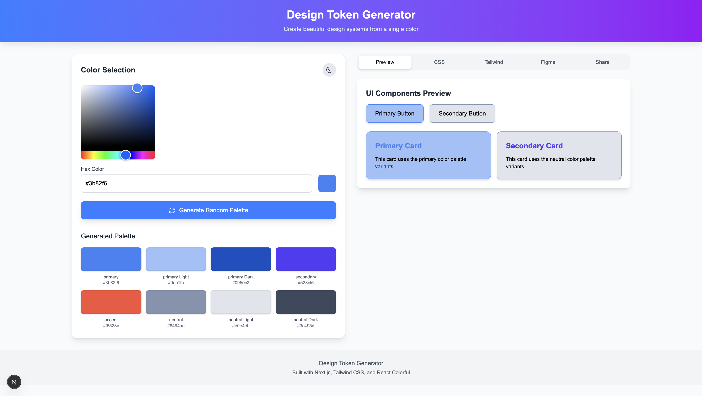

# Design Token Generator



A professional tool for designers and developers to generate complete color systems from a single base color, with export options for popular frameworks.

## Live Site 
https://design-token-generator.vercel.app/

## Features

### Color System Generation
- **8-Color Palette** - Primary, secondary, accent, and neutral colors
- **Light/Dark Variants** - Automatically adjusted for theme modes
- **WCAG 2.1 Compliant** - Real-time contrast ratio checking
- **Visual Preview** - See colors applied to UI components

### Export Options
- **CSS Variables** - Ready-to-use custom properties
- **Tailwind Config** - Complete color configuration
- **Figma Tokens** - JSON for design systems
- **Shareable Links** - URL with encoded color palette

### Interactive Features
- **Color Picker** - Hex/RGB selection
- **Drag & Drop** - Reorder palette colors
- **Dark/Light Mode** - Full theme support
- **Responsive Design** - Works on all devices

## Quick Start

### Prerequisites
- Node.js v18+
- npm/yarn/pnpm

### Installation
```bash
# Clone the repository
git clone https://github.com/figgynwtn/design-token-generator.git

# Navigate to project directory
cd design-token-generator

# Install dependencies
npm install

# Start development server
npm run dev
